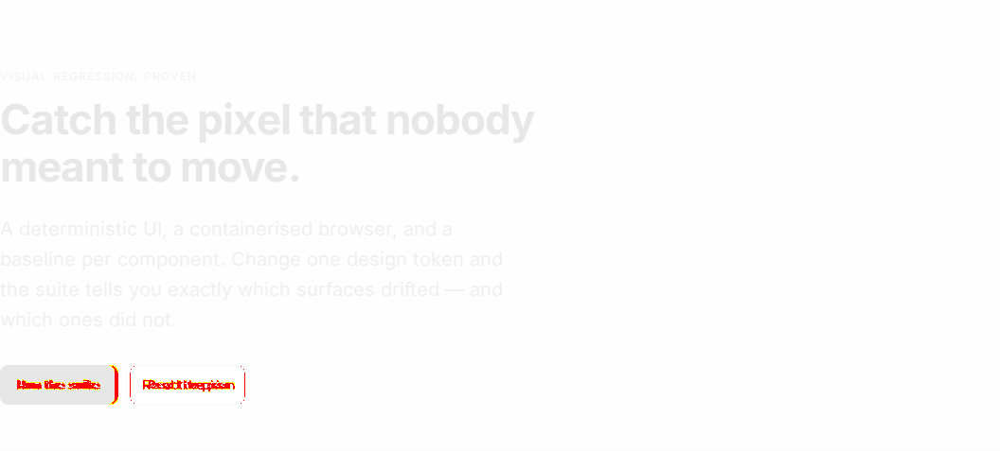
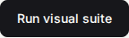

# pixel-perfect-poc

Pixel-level visual regression testing with **Playwright + Vite + React**, where the baselines
actually survive the trip from a laptop to CI.

The assertion is the easy part — Playwright ships native pixel comparison. The hard part is
**render determinism**: a screenshot baseline is a function of the OS, the CPU architecture, the
font rasterizer, animation timing, and your data. Get any of those wrong and you end up with a
suite that is either permanently red or quietly blind.

This repository is the experiment. Every number below was measured here, not estimated.

---

## Change one token, see exactly what moved

`--space-4: 16px → 18px`. One line. The suite localizes the blast radius:



Red is what changed; ghosted grey is what didn't. The buttons moved. The heading and the
paragraph did not.

At the component level the report is even blunter — it reports geometry, not pixel counts:

| Baseline | Actual | Diff |
| --- | --- | --- |
|  |  |  |
| `140 × 43` | `144 × 43` | 2px of padding on each side |

**9 of 15 snapshots failed. 6 passed.** The 6 that passed are the three `Badge` and three `Input`
states — components that consume no spacing token. That is the point of per-component snapshots:
the failures point at the cause instead of at the whole page.

---

## Quick start

Requires Docker. Browsers come from the image; you do not install them locally.

```bash
pnpm install
pnpm test:visual:docker          # run the suite against committed baselines
pnpm test:visual:docker:update   # rewrite baselines (the only sanctioned way)
pnpm test:visual:report          # open the HTML report with expected/actual/diff
```

Try it yourself: change `--space-4` in `src/styles/tokens.css`, run the suite, open the report.

---

## How determinism is enforced

Every entry here removes one specific source of flakiness. Remove any one of them and the suite
starts failing on an unchanged tree.

| Source of drift | Countermeasure |
| --- | --- |
| Font loading race | Self-hosted `@fontsource/inter`, never a CDN, plus a `document.fonts.ready` await before every capture (`tests/visual/fixtures.ts`) |
| Animations & transitions | `animations: 'disabled'` plus a belt-and-braces `screenshot.css` injected only at capture time |
| Text caret blink | `caret: 'hide'` and `caret-color: transparent` |
| Scrollbar width | Hidden in `screenshot.css` — it differs across platforms and steals layout space |
| Device pixel ratio | Fixed `1280×720` viewport, `deviceScaleFactor: 1`, `scale: 'css'` |
| Dynamic content | The landing page carries a timestamp, masked via `mask: [...]` — the escape hatch every real project needs |
| Dev-server variance | Tests run against `build` + `preview`, never the dev server with its HMR client |
| **Stale server** | `reuseExistingServer: false` — see Findings, this one bit us |
| **Host OS** | Everything runs in `mcr.microsoft.com/playwright:v1.62.1-noble`, and CI uses the same image tag |

---

## Findings

### 1. The OS is the pinning axis. The CPU architecture is not.

This was the open question the repo existed to answer, and the intuitive guess was wrong.

Running the suite **natively on macOS** against baselines generated in the Linux container, with
byte-identical source:

| Snapshot | Baseline (Linux) | macOS | |
| --- | --- | --- | --- |
| `btn-default` | `140 × 43` | `139 × 43` | 1px narrower |
| `landing-full` | `1280 × 1315` | `1280 × 1338` | 23px taller |
| `landing-hero` | — | 8,941 differing pixels | |
| **Total** | | **15 of 15 failed** | |

Running the same baselines under **`linux/arm64` instead of `linux/amd64`**:

> **15 of 15 passed.**

So the amd64 pin this project started with was unnecessary. Removing it dropped QEMU emulation on
Apple Silicon and took a full run from **~14s to 3.4s** — a 4× speedup for free.
`docker-compose.amd64.yml` remains if you ever need to reproduce a CI runner bit for bit.

**Why this matters:** the deliberate 2px regression moved the landing page by **31px**. The
macOS-vs-Linux platform difference moves it by **23px**. Same order of magnitude. Generate
baselines on your laptop and run CI on Linux, and you cannot tell a real regression from an
operating system. That is the entire argument for containerising this, expressed as a number
instead of an opinion.

### 2. `threshold: 0` is too strict, and the control group proved it

The suite started at `threshold: 0, maxDiffPixels: 0` on the principle that starting loose hides
the instability you are trying to measure. That principle was right; the value was not.

`Badge` deliberately consumes no spacing token — it is the control group. On the token change it
should have stayed green. It failed: **18 differing pixels at a maximum delta of 1/255.** An
independent re-measurement found 36 pixels at 2/255. Either way it is sub-perceptual rasterization
noise that no human could see.

Final configuration, and the reasoning for each half:

```ts
threshold: 0.2,      // per-pixel YIQ colour distance — absorbs raster noise
maxDiffPixels: 0,    // ...but zero tolerance for pixels that clear that bar
```

`threshold: 0.2` is Playwright's own default. It does **not** hide real changes: every geometry
shift in the regression still failed loudly. Loosening *both* knobs at once is how suites go blind.

### 3. `reuseExistingServer` is a trap for visual tests

`reuseExistingServer: !process.env.CI` is the standard Playwright idiom and it produced a phantom
failure here. A `vite preview` process left running from an earlier run kept serving a stale
bundle, so a later run compared fresh baselines against old CSS and reported 15/15 failures that
had nothing to do with the code under test.

For a functional test, reusing a warm server is a harmless speedup. For a visual test it silently
compares against whatever bytes that server happens to be holding. The config now always rebuilds.

The tell: a delta that suspiciously equals a change you made earlier.

### 4. Per-component snapshots earn their keep

| Strategy | Catches | Costs |
| --- | --- | --- |
| Per-component (11 baselines) | The specific component that drifted | More files to review |
| Full-page (1 baseline) | Spacing *between* components, stacking, layout | One change reddens everything |

Neither replaces the other. The regression demonstrated it precisely: 6 component snapshots stayed
green and told you where *not* to look, while the full-page snapshot confirmed the cumulative
effect was 31px of drift.

---

## Layout

```
src/components/      Button, Card, Badge, Input — pure props, no state, no dates
src/routes/          Gallery (11 isolated states) + Landing (composed page)
src/styles/tokens.css  every visual value; the regression lever
tests/visual/
  components.spec.ts   per-component, per-state, plus a driven hover state
  landing.spec.ts      full page with a masked timestamp + a clipped region
  tolerance.spec.ts    documents what threshold and maxDiffPixelRatio actually do
  __screenshots__/     committed baselines
docker-compose.visual.yml   the authoritative environment
.github/workflows/visual.yml  same image tag — that identity is the whole thesis
```

---

## Honest limits

- **Baselines are binary blobs in git.** Fine at 15 snapshots. At a few hundred, across several
  viewports and themes, repository size becomes a real problem — and that is the point where
  hosted services (Chromatic, Percy) start earning their cost. They solve baseline storage and
  team approval workflow, not comparison; Playwright already does the comparison well.
- **One browser, one viewport.** Adding Firefox, WebKit, or a mobile viewport multiplies the
  baseline count by the number of combinations, not adds to it.
- **This is a POC.** It proves the mechanism and quantifies the constraints. It does not address
  review workflow, which is the thing that actually decides whether a visual suite survives
  contact with a team.

## License

MIT
